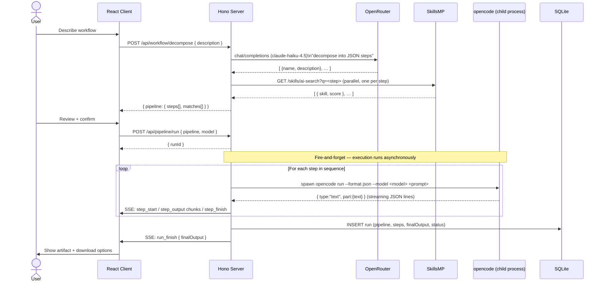
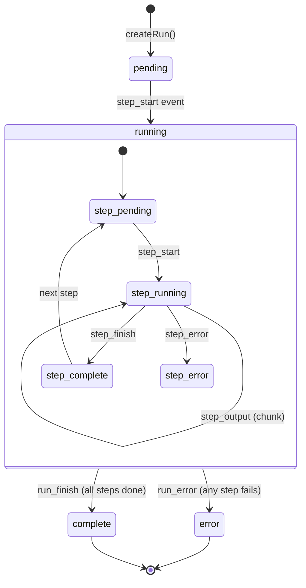
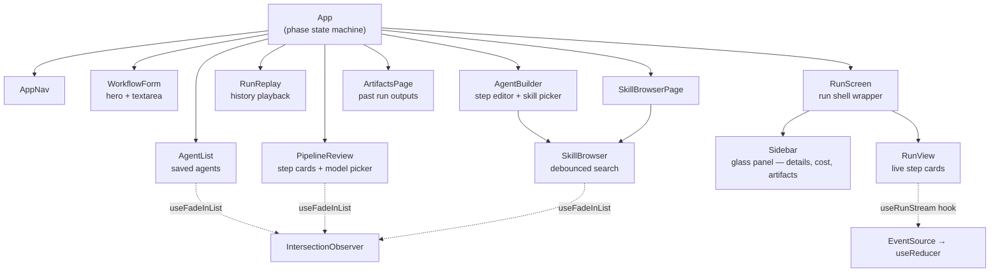
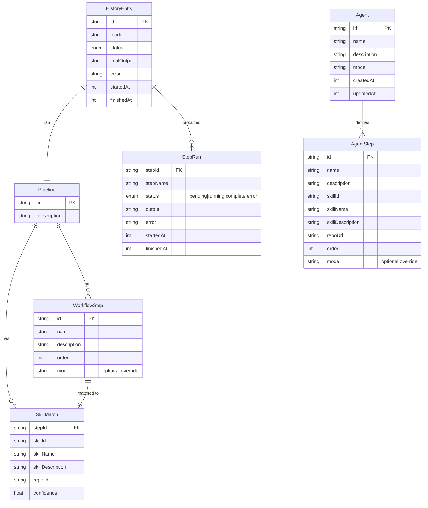

# SkillRunner

**Compose AI workflows from plain English. Each step runs a dedicated agent preloaded with a matched skill. Outputs chain automatically. One final artifact.**

SkillRunner turns a natural-language description of a task into a multi-step pipeline where every step is executed by an isolated AI agent. You describe *what* you want done; SkillRunner figures out *which skills* to use, *which model* to run each step on, and streams the results back in real time.

---

## Table of contents

- [How it works](#how-it-works)
- [Architecture](#architecture)
  - [System overview](#system-overview)
  - [Request & execution flow](#request--execution-flow)
  - [SSE streaming pipeline](#sse-streaming-pipeline)
  - [Run state machine](#run-state-machine)
  - [Client component tree](#client-component-tree)
  - [Data model](#data-model)
- [Technical decisions](#technical-decisions)
- [Trade-offs](#trade-offs)
- [Project structure](#project-structure)
- [Getting started](#getting-started)
- [Environment variables](#environment-variables)
- [API reference](#api-reference)
- [Supported models](#supported-models)
- [Development notes](#development-notes)

---

## How it works

1. **Describe** a workflow in plain English — *"Scrape a URL, summarise the content, write a LinkedIn post"*
2. **Decompose** — the server calls OpenRouter (Claude Haiku) to split the description into discrete named steps
3. **Match** — each step is sent to the SkillsMP AI search API; the best matching skill (a GitHub-hosted prompt/agent config) is attached
4. **Review** — the proposed pipeline is shown to the user, who can inspect each step's matched skill and choose a model
5. **Run** — the server spawns one `opencode` subprocess per step in sequence; each agent receives the previous step's output as context
6. **Stream** — progress events are emitted over SSE in real time; the client reconstructs state with a reducer
7. **Collect** — the final step's output is saved to SQLite and offered as a downloadable artifact

---

## Architecture

### System overview

```mermaid
graph TB
    subgraph Browser["Browser (React + Vite)"]
        UI[WorkflowForm / AgentBuilder]
        RV[RunView — live SSE consumer]
        SB[SkillBrowser]
    end

    subgraph Server["Server (Node.js + Hono)"]
        WR[POST /api/workflow/decompose]
        PR[POST /api/pipeline/run]
        SSE[GET /api/pipeline/:id/stream]
        AR[/api/agents CRUD]
        SKR[GET /api/skills/search]
        RS[runs store — in-memory EventEmitter]
        DB[(SQLite — better-sqlite3)]
    end

    subgraph External["External services"]
        OR[OpenRouter\nOpenAI-compatible API]
        SMP[SkillsMP\nskillsmp.com/api/v1]
        OC[opencode CLI\nspawned as child process]
    end

    UI -->|"POST description"| WR
    WR -->|"chat/completions (Haiku)"| OR
    WR -->|"GET /skills/ai-search"| SMP
    WR -->|pipeline + matches| UI

    UI -->|"POST pipeline + model"| PR
    PR --> RS
    PR -->|"startRun()"| OC
    OC -->|"JSON events on stdout"| RS
    RS -->|EventEmitter| SSE
    SSE -.->|"text/event-stream"| RV

    PR -->|persist on finish| DB
    AR --> DB
    SB -->|"GET /api/skills/search"| SKR
    SKR -->|proxy| SMP
```

### Request & execution flow



### SSE streaming pipeline

The server uses a hybrid **replay + live** pattern so clients that connect after the run has already started (or even finished) still receive the full event history.

```mermaid
flowchart LR
    subgraph Server
        EM[EventEmitter\nper run]
        EV[events[]\naccumulated history]
        EM -->|push| EV
    end

    subgraph SSE handler
        R[Replay past events\nfrom events array]
        L[Subscribe to\nnew events via emitter]
        R --> L
    end

    subgraph Client
        ES[EventSource]
        RD[useReducer\ndispatch]
        UI2[RunView UI]
        ES --> RD --> UI2
    end

    EM -->|emit 'event'| L
    SSE handler -->|writeSSE| ES
```

**Why this matters:** if the network drops and the client reconnects, or the user opens `/run/:id` directly, they see the complete run history — not just events from the moment they connected.

### Run state machine



Both the **in-memory store** (for live SSE) and **SQLite** (for persistence) track this state. The in-memory store uses a `PipelineRunState` with an `EventEmitter`; SQLite receives a final snapshot when the run terminates.

### Client component tree



**Phase transitions** in `App` act as a lightweight client-side router. URL is kept in sync via `history.pushState` without a router library.

### Data model



**SQLite schema** (two tables):

| Table    | Key columns                                                                 |
|----------|-----------------------------------------------------------------------------|
| `runs`   | `id`, `pipeline_json`, `model`, `status`, `steps_json`, `final_output`, `error`, `started_at`, `finished_at` |
| `agents` | `id`, `name`, `description`, `model`, `steps_json`, `created_at`, `updated_at` |

Both tables store nested structures as JSON columns to avoid schema migrations as the data shapes evolve.

---

## Technical decisions

### OpenCode as the agent runtime

SkillRunner uses [OpenCode](https://opencode.ai) — an open-source, embeddable AI coding agent — as the execution engine for each pipeline step. It is spawned as a child process via `opencode run --format json --model <id> <prompt>`.

**Why not call OpenRouter directly from the server?**

OpenCode gives each step a fully autonomous agent: it can read files, run shell commands, browse the web, and use tools — not just produce text. A raw `chat/completions` call would only generate text. Skills from SkillsMP are designed as OpenCode-compatible instructions, so the runtime match is exact.

**Why a child process instead of an SDK?**

OpenCode doesn't expose a Node.js SDK. Spawning it as a subprocess is the documented integration path. The `--format json` flag causes it to emit structured JSON events on stdout (one per line), which the server parses with a streaming line buffer.

```
opencode run --format json --model openrouter/anthropic/claude-haiku-4.5 "<prompt>"
↓
{"type":"text","part":{"text":"chunk..."}}
{"type":"text","part":{"text":"more..."}}
(process exits 0)
```

### OpenRouter for model routing

OpenRouter provides a single OpenAI-compatible endpoint that proxies 200+ models. This means:

- **No per-provider SDK juggling** — one API key, one base URL, consistent request format
- **Model IDs are portable** — switching from GPT-4.1 to Gemini 2.5 Pro is a string change
- **Fallback routing** — OpenRouter handles provider outages transparently

The workflow decomposition step always uses `anthropic/claude-haiku-4.5` (fast, cheap, reliable at structured JSON output). Pipeline execution uses whichever model the user selects, including per-step overrides.

**Model ID translation:**  
OpenCode expects model IDs in the form `openrouter/<provider>/<model>`, while OpenRouter uses `<provider>/<model>`. The shared `toOpencodeModelId()` function handles this:

```ts
// anthropic/claude-sonnet-4.6  →  openrouter/anthropic/claude-sonnet-4.6
// openai/gpt-4.1-nano           →  openrouter/openai/gpt-4.1-nano
```

It also normalises legacy version strings (e.g. `claude-3-5-haiku` → `claude-3.5-haiku`) for older model IDs that use hyphens instead of dots.

### SkillsMP for skill discovery

[SkillsMP](https://skillsmp.com) is a marketplace of AI skills — each skill is a GitHub-hosted file (prompt, system message, or agent config) authored by the community. SkillRunner queries the `/skills/ai-search` endpoint with the step name and description as a natural-language query; SkillsMP returns ranked results with confidence scores.

The best match is attached to each step as a `SkillMatch`. When the agent runs, the skill name, description, and GitHub URL are injected into the system prompt. If no skill is found (`skillId === "no-match"`), the agent falls back to general reasoning.

**Skills are advisory, not imperative.** The agent is not forced to follow a skill — the skill provides context and intent, not executable code. This is a deliberate choice: brittle skill execution (fetching and running remote code per step) introduces security and reliability risks not worth taking in v1.

### Hono as the server framework

[Hono](https://hono.dev) was chosen over Express for several reasons:

| Concern | Express | Hono |
|---------|---------|------|
| TypeScript support | Add-on | First-class |
| SSE streaming | Manual | Built-in `streamSSE` |
| Bundle size | ~200 KB | ~15 KB |
| Edge-compatible | No | Yes (future option) |
| Request typing | Weak | Strong generics |

The `streamSSE` helper from `hono/streaming` handles backpressure and client disconnect cleanly, which is critical for the live run view.

### SQLite for persistence

SQLite (via `better-sqlite3`) stores completed runs and saved agents. The database file lives at `.skillrunner.db` in the repo root.

**Why SQLite instead of nothing?**

In-memory state (`Map<runId, PipelineRunState>`) is lost on server restart. Without persistence, the history panel and artifacts page would be empty after any restart. SQLite adds persistence with zero operational overhead — no database server, no migrations tool, no connection pool.

**Why not PostgreSQL?**

This is an explicitly local-first tool. PostgreSQL would require Docker or a managed service, defeating the "clone and run" goal.

**Schema design — JSON columns:** Pipeline, steps, and matches are stored as JSON strings rather than normalised tables. This trades query flexibility for schema stability: the TypeScript types are the schema, and adding fields to a type doesn't require an ALTER TABLE.

### SSE over WebSockets

Server-Sent Events were chosen over WebSockets for real-time streaming because:

- **Unidirectional** — the server pushes events; the client never needs to send messages mid-run
- **HTTP/1.1 compatible** — no upgrade handshake, works through most proxies
- **Built-in reconnect** — the browser `EventSource` API auto-reconnects on drop
- **Replay on connect** — the server buffers all events and replays them to late-connecting clients (see [SSE streaming pipeline](#sse-streaming-pipeline) above)
- **Simpler error handling** — a failed SSE connection degrades gracefully; a dropped WebSocket requires more state management

### Monorepo with npm workspaces

The project uses three packages:

```
packages/shared/   — TypeScript types + model list, compiled to dist/
server/            — Hono API server
client/            — React + Vite SPA
```

`@skillrunner/shared` is compiled (`tsc`) and imported by both `server` and `client` as a proper package. This ensures the type contract between client and server is enforced at build time, not just at runtime.

**Important:** after editing `packages/shared/src/types.ts`, run `npm run build -w packages/shared` before the changes appear in client or server builds.

---

## Trade-offs

### Sequential step execution vs. parallel

Steps run **one at a time**, each receiving the previous step's output. This is intentional: most useful workflows have data dependencies between steps (step 2 needs step 1's output). Parallel execution would require explicit dependency graphs and a more complex scheduler.

**Cost:** slower wall-clock time for independent steps.  
**Benefit:** simpler mental model, correct by default, easier debugging.

### No streaming from OpenRouter in decomposition

The workflow decomposition call (`/api/workflow/decompose`) uses a non-streaming `chat/completions` request and waits for the full JSON array before responding to the client. This is intentional: partial JSON cannot be parsed, and the decomposition must be complete before skill matching can begin.

**Cost:** the "Build pipeline" button shows a spinner for 2–5 seconds.  
**Benefit:** error handling is straightforward; no partial state to manage.

### Prompt injection as skill context vs. skill execution

Skills are injected as *context* in the prompt, not *executed* as code. This means:

- ✅ No remote code execution surface
- ✅ No dependency on skill repo uptime
- ✅ Works even if the skill GitHub URL 404s
- ❌ The agent may not follow the skill exactly
- ❌ Skills designed as code templates won't work as intended

This trade-off is acceptable for v1. A future version could fetch the skill file from GitHub and include its full content, giving the agent more precise instructions.

### In-memory run state with eventual SQLite persistence

Live runs are tracked in a `Map` in the server process. SQLite is written only when a run terminates. This means:

- ✅ Zero database latency during streaming
- ✅ EventEmitter fan-out is trivially fast
- ❌ If the server crashes mid-run, the run is lost (status stays `running` in SQLite if it was previously saved — it won't be, since saves happen on completion)
- ❌ Multiple server instances cannot share run state

For a single-user local tool, these limitations are acceptable.

### No authentication

There is no auth layer. SkillRunner is designed as a local development tool. API keys (OpenRouter, SkillsMP) live in a `.env` file and are never exposed to the client. The server should not be exposed to the public internet without adding authentication.

---

## Project structure

```
skillrunner/
├── .skillrunner.db          # SQLite database (created on first run)
├── .env                     # Environment variables (not committed)
├── .env.example             # Template
├── package.json             # Workspace root — dev/build scripts
├── tsconfig.base.json       # Shared TypeScript config
│
├── packages/
│   └── shared/              # @skillrunner/shared
│       └── src/
│           ├── types.ts     # All shared types + SUPPORTED_MODELS
│           └── index.ts     # Re-export barrel
│
├── server/
│   └── src/
│       ├── index.ts         # Hono app + server startup
│       ├── env.ts           # Zod-validated environment config
│       ├── routes/
│       │   ├── workflow.ts  # POST /api/workflow/decompose
│       │   ├── pipeline.ts  # POST /api/pipeline/run
│       │   ├── stream.ts    # GET  /api/pipeline/:id/stream (SSE)
│       │   ├── history.ts   # GET  /api/runs
│       │   ├── skills.ts    # GET  /api/skills/search
│       │   └── agents.ts    # CRUD /api/agents + POST /:id/run
│       ├── services/
│       │   ├── openrouter.ts  # Workflow decomposition via LLM
│       │   ├── skillsmp.ts    # Skill discovery + proxy
│       │   └── runner.ts      # OpenCode subprocess orchestration
│       └── store/
│           ├── runs.ts        # In-memory run state + EventEmitter
│           └── db.ts          # SQLite read/write via better-sqlite3
│
└── client/
    └── src/
        ├── main.tsx
        ├── App.tsx              # Phase state machine + top-level routing
        ├── api/
        │   ├── client.ts        # Typed fetch wrappers for workflow/pipeline
        │   └── agents.ts        # Typed fetch wrappers for agents/skills
        ├── components/
        │   ├── WorkflowForm.tsx
        │   ├── PipelineReview.tsx
        │   ├── RunView.tsx
        │   ├── RunReplay.tsx
        │   ├── Sidebar.tsx
        │   ├── HistoryPanel.tsx
        │   ├── AgentList.tsx
        │   ├── AgentBuilder.tsx
        │   ├── SkillBrowser.tsx
        │   ├── ArtifactsPage.tsx
        │   └── ArtifactDownload.tsx
        ├── hooks/
        │   ├── useRunStream.ts   # EventSource → useReducer
        │   └── useFadeInList.ts  # IntersectionObserver stagger reveal
        ├── styles/
        │   ├── global.css        # Design tokens, base resets, animations
        │   └── components.css    # All component styles
        └── utils/
            ├── cost.ts           # Token estimation + USD formatting
            └── uuid.ts           # Client-side UUID generation
```

---

## Getting started

### Prerequisites

| Tool | Version | Purpose |
|------|---------|---------|
| Node.js | ≥ 20 | Server + build |
| npm | ≥ 10 | Workspace management |
| opencode | latest | Agent execution runtime |

Install OpenCode:
```bash
npm install -g opencode-ai
```

### Installation

```bash
git clone <repo>
cd skillrunner
npm install
```

### Configure environment

```bash
cp .env.example .env
```

Edit `.env`:

```env
SKILLSMP_API_KEY=sk_live_...     # https://skillsmp.com/docs/api
OPENROUTER_API_KEY=sk-or-...     # https://openrouter.ai/keys
PORT=3001                         # optional, defaults to 3001
```

### Run in development

```bash
npm run dev
```

This starts both the Hono server (port 3001) and Vite dev server (port 5173) concurrently with colour-coded output.

### Build for production

```bash
npm run build
```

Outputs:
- `packages/shared/dist/` — compiled shared types
- `server/dist/` — compiled server (run with `node server/dist/index.js`)
- `client/dist/` — static SPA (serve behind any static file server)

---

## Environment variables

| Variable | Required | Description |
|----------|----------|-------------|
| `SKILLSMP_API_KEY` | Yes | API key from [skillsmp.com](https://skillsmp.com/docs/api). Used for skill discovery on every workflow decomposition and agent step. |
| `OPENROUTER_API_KEY` | Yes | API key from [openrouter.ai](https://openrouter.ai). Used for workflow decomposition (server-side) and injected into OpenCode's environment for step execution. |
| `PORT` | No | HTTP port for the Hono server. Defaults to `3001`. |

The server validates all required variables at startup using [Zod](https://zod.dev) and exits immediately with a descriptive error if any are missing or malformed.

---

## API reference

### `POST /api/workflow/decompose`

Decompose a natural-language description into a pipeline with matched skills.

**Request**
```json
{ "description": "Scrape a URL, summarise the content, write a LinkedIn post" }
```

**Response**
```json
{
  "pipeline": {
    "id": "uuid",
    "description": "...",
    "steps": [
      { "id": "step-1", "name": "Scrape target URL", "description": "...", "order": 0 }
    ],
    "matches": [
      {
        "stepId": "step-1",
        "skillId": "abc123",
        "skillName": "Web Scraper",
        "skillDescription": "...",
        "repoUrl": "https://github.com/...",
        "confidence": 0.87
      }
    ]
  }
}
```

---

### `POST /api/pipeline/run`

Start executing a confirmed pipeline. Returns immediately with a `runId`; progress is streamed via SSE.

**Request**
```json
{
  "pipeline": { "id": "...", "steps": [...], "matches": [...] },
  "model": "anthropic/claude-haiku-4.5"
}
```

**Response**
```json
{ "runId": "uuid" }
```

---

### `GET /api/pipeline/:runId/stream`

SSE endpoint. Emits one JSON event per `data:` line. Replays all past events on connect, then streams new ones until the run terminates.

**Event types**

| Type | Payload |
|------|---------|
| `step_start` | `{ runId, stepId, stepName, order, startedAt }` |
| `step_output` | `{ runId, stepId, chunk }` — may fire many times |
| `step_finish` | `{ runId, stepId, output, finishedAt }` |
| `step_error` | `{ runId, stepId, error, finishedAt }` |
| `run_finish` | `{ runId, finalOutput }` |
| `run_error` | `{ runId, error }` |

---

### `GET /api/runs`

List past runs from SQLite.

**Query params:** `?limit=20` (default 20)

**Response:** `{ "runs": HistoryEntry[] }`

---

### `GET /api/runs/:id`

Fetch a single historical run.

---

### `GET /api/skills/search`

Proxy to SkillsMP AI search.

**Query params:** `?q=<query>&limit=12`

**Response:** `{ "results": SkillSearchResult[], "query": string }`

---

### `GET /api/agents`

List all saved agents.

### `POST /api/agents`

Create a new agent.

**Request**
```json
{
  "name": "Newsletter to LinkedIn",
  "description": "Summarises a newsletter and writes a LinkedIn post",
  "model": "anthropic/claude-sonnet-4.5",
  "steps": [
    {
      "id": "uuid",
      "name": "Summarise newsletter",
      "description": "Extract the key points",
      "skillId": "abc",
      "skillName": "Text Summariser",
      "skillDescription": "...",
      "repoUrl": "https://github.com/...",
      "order": 0,
      "model": "anthropic/claude-haiku-4.5"
    }
  ]
}
```

### `PUT /api/agents/:id`

Update an existing agent (full replacement of mutable fields).

### `DELETE /api/agents/:id`

Delete an agent.

### `POST /api/agents/:id/run`

Run a saved agent.

**Request** (all optional)
```json
{ "input": "optional context for step 1", "model": "override model" }
```

**Response:** `{ "runId": "uuid", "pipelineId": "uuid" }`

---

## Supported models

Models are defined in `packages/shared/src/types.ts` as `SUPPORTED_MODELS`. The list is verified against the live OpenRouter API. As of **April 2026**:

| Provider | Model ID | Notes |
|----------|----------|-------|
| Anthropic | `anthropic/claude-haiku-4.5` | Default — fast, cheap |
| Anthropic | `anthropic/claude-sonnet-4.5` | Balanced |
| Anthropic | `anthropic/claude-sonnet-4.6` | Latest, 1M context |
| Anthropic | `anthropic/claude-opus-4.5` | Capable |
| Anthropic | `anthropic/claude-opus-4.6` | Most capable, 1M context |
| OpenAI | `openai/gpt-4.1-nano` | Fastest, cheapest |
| OpenAI | `openai/gpt-4.1-mini` | Fast |
| OpenAI | `openai/gpt-4.1` | Capable, 1M context |
| OpenAI | `openai/gpt-4o` | Proven multimodal |
| OpenAI | `openai/o4-mini` | Reasoning, fast |
| OpenAI | `openai/o3` | Strong reasoning |
| Google | `google/gemini-2.0-flash-001` | Fast, 1M context |
| Google | `google/gemini-2.5-flash-lite` | Fastest Gemini 2.5 |
| Google | `google/gemini-2.5-flash` | Balanced, 1M context |
| Google | `google/gemini-2.5-pro` | Best Google model |
| xAI | `x-ai/grok-3-mini` | Reasoning |
| xAI | `x-ai/grok-4` | Latest xAI, 256K context |
| Meta | `meta-llama/llama-4-scout` | Open, fast |
| Meta | `meta-llama/llama-4-maverick` | Open, capable, 1M context |
| Meta | `meta-llama/llama-3.3-70b-instruct` | Open, proven |
| Mistral | `mistralai/mistral-small-3.2-24b-instruct` | Open, cheapest |
| Mistral | `mistralai/mistral-large-2512` | Capable, good price |
| DeepSeek | `deepseek/deepseek-chat-v3-0324` | Open, capable |
| DeepSeek | `deepseek/deepseek-r1-0528` | Open, reasoning |
| Qwen | `qwen/qwen3-32b` | Open, very cheap |
| Qwen | `qwen/qwen3-235b-a22b-2507` | Open, huge, cheapest per token |
| Moonshot | `moonshotai/kimi-k2` | Long context |

**Per-step model override:** in the Agent Builder, each step can use a different model than the agent's default. A common pattern is to use a cheap fast model (Haiku, GPT-4.1 Nano) for data processing steps and a capable model (Sonnet, GPT-4.1) only for the final synthesis step.

---

## Development notes

### Rebuilding the shared package

After any change to `packages/shared/src/`:

```bash
npm run build -w packages/shared
```

The client and server both import from `packages/shared/dist/`. The dev server does **not** watch the shared package automatically.

### Type checking

```bash
npm run typecheck
```

Runs `tsc --noEmit` across all three packages in dependency order.

### Adding a new model

Edit `SUPPORTED_MODELS` in `packages/shared/src/types.ts`, then rebuild shared. Model IDs must match the OpenRouter format (`provider/model-name`). The `toOpencodeModelId()` function handles the translation to OpenCode's `openrouter/provider/model` format automatically.

To verify a model ID is live on OpenRouter before adding it:

```bash
source .env
curl -s https://openrouter.ai/api/v1/models \
  -H "Authorization: Bearer $OPENROUTER_API_KEY" \
  | python3 -c "import json,sys; [print(m['id']) for m in json.load(sys.stdin)['data']]" \
  | grep <model-name>
```

### Adding a new route

1. Create `server/src/routes/<name>.ts` exporting a `const <name>Router = new Hono()`
2. Mount it in `server/src/index.ts`: `app.route("/api/<path>", <name>Router)`
3. Add corresponding fetch helpers in `client/src/api/`
4. Add request/response types to `packages/shared/src/types.ts`

### SQLite location

The database file is created at `<repo-root>/.skillrunner.db` on first run. To reset all history and agents:

```bash
rm .skillrunner.db
```

The schema is recreated automatically on next startup via `CREATE TABLE IF NOT EXISTS`.
