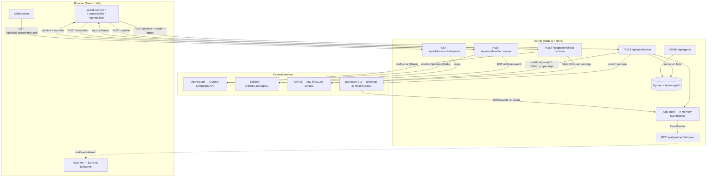
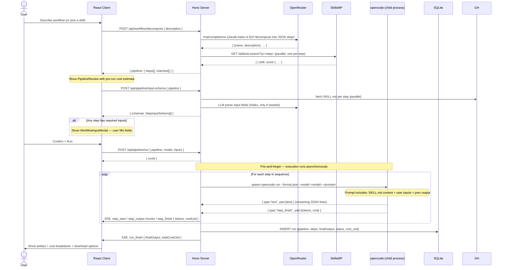
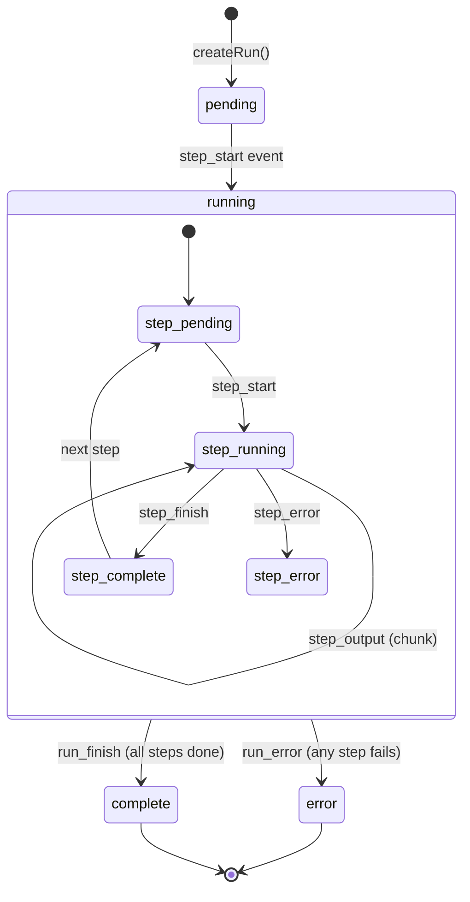
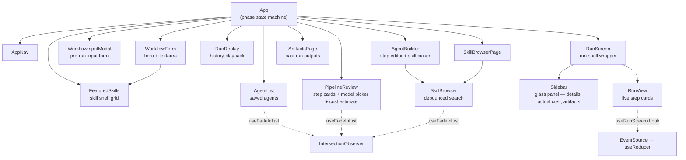
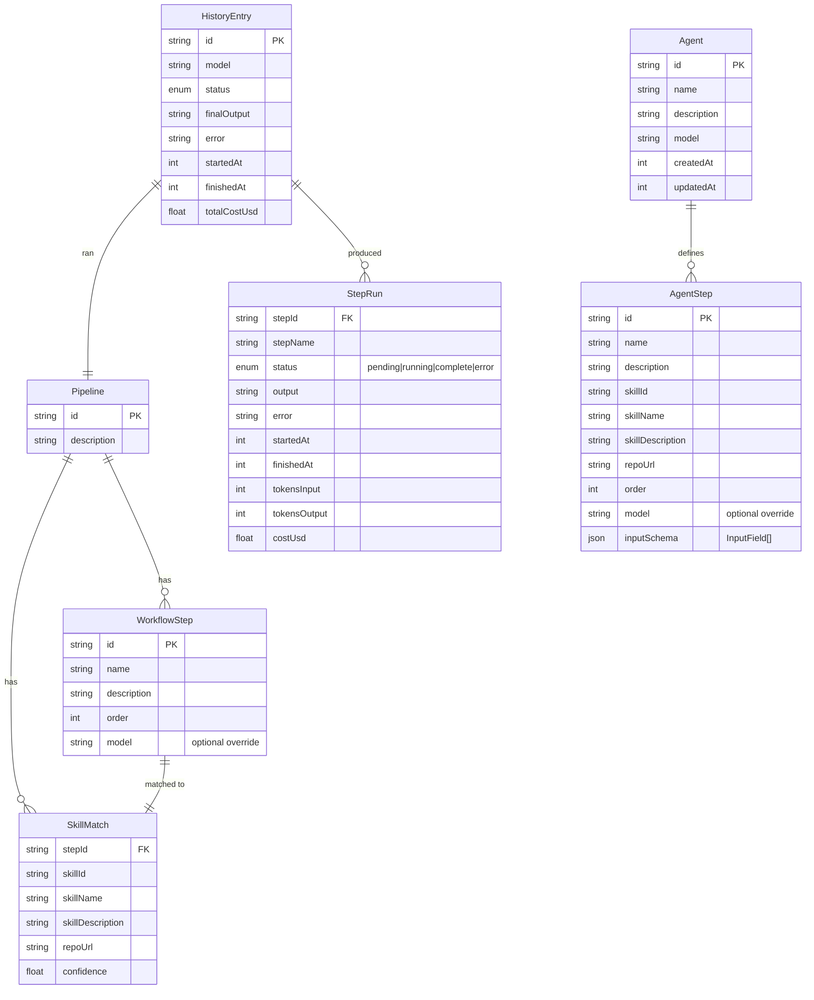

# Agentique

**Compose AI workflows from plain English. Each step runs a dedicated agent preloaded with a matched skill. Outputs chain automatically. One final artifact.**

Agentique turns a natural-language description of a task into a multi-step pipeline where every step is executed by an isolated AI agent. You describe *what* you want done; Agentique figures out *which skills* to use, *which model* to run each step on, and streams the results back in real time.

---

## Table of contents

- [How it works](#how-it-works)
- [Architecture](#architecture)
  - [System overview](#system-overview)
  - [Request & execution flow](#request--execution-flow)
  - [SSE streaming pipeline](#sse-streaming-pipeline)
  - [Run state machine](#run-state-machine)
  - [Client component tree](#client-component-tree)
  - [Data model](#data-model)
- [Features](#features)
  - [Discovery-first skill shelf](#discovery-first-skill-shelf)
  - [Input forms from skill schema](#input-forms-from-skill-schema)
  - [Cost estimates](#cost-estimates)
- [Technical decisions](#technical-decisions)
- [Trade-offs](#trade-offs)
- [Project structure](#project-structure)
- [Getting started](#getting-started)
- [Environment variables](#environment-variables)
- [API reference](#api-reference)
- [Supported models](#supported-models)
- [Development notes](#development-notes)

---

## How it works

1. **Discover or describe** — browse the featured skill shelf on the home screen and start directly from a skill, or describe a workflow in plain English
2. **Decompose** — the server calls OpenRouter (Claude Haiku) to split the description into discrete named steps
3. **Match** — each step is sent to the SkillsMP AI search API; the best matching skill (a GitHub-hosted prompt/agent config) is attached
4. **Review** — the proposed pipeline is shown with a pre-run cost estimate; the user inspects each step's matched skill and chooses a model
5. **Configure** — if any skill declares required inputs (via SKILL.md schema), a blocking form collects them before the run starts; values are injected into each agent's prompt
6. **Run** — before each step executes, the server fetches the skill's `SKILL.md` from GitHub and injects its full text into the agent prompt; one `opencode` subprocess is spawned per step in sequence; each agent receives the previous step's output as context
7. **Stream** — progress events are emitted over SSE in real time; the client reconstructs state with a reducer
8. **Collect** — the final step's output is saved to SQLite and offered as a downloadable artifact; actual token usage and cost from OpenRouter are recorded per step

---

## Architecture

### System overview



### Request & execution flow



### SSE streaming pipeline

The server uses a hybrid **replay + live** pattern so clients that connect after the run has already started (or even finished) still receive the full event history.

```mermaid
flowchart LR
    subgraph Server
        EM[EventEmitter\nper run]
        EV[events[]\naccumulated history]
        EM -->|push| EV
    end

    subgraph SSE handler
        R[Replay past events\nfrom events array]
        L[Subscribe to\nnew events via emitter]
        R --> L
    end

    subgraph Client
        ES[EventSource]
        RD[useReducer\ndispatch]
        UI2[RunView UI]
        ES --> RD --> UI2
    end

    EM -->|emit 'event'| L
    SSE handler -->|writeSSE| ES
```

**Why this matters:** if the network drops and the client reconnects, or the user opens `/run/:id` directly, they see the complete run history — not just events from the moment they connected.

### Run state machine



Both the **in-memory store** (for live SSE) and **SQLite** (for persistence) track this state. The in-memory store uses a `PipelineRunState` with an `EventEmitter`; SQLite receives a final snapshot when the run terminates.

### Client component tree



**Phase transitions** in `App` act as a lightweight client-side router. URL is kept in sync via `history.pushState` without a router library.

### Data model



**SQLite schema** (two tables):

| Table    | Key columns |
|----------|-------------|
| `runs`   | `id`, `pipeline_json`, `model`, `status`, `steps_json`, `final_output`, `error`, `started_at`, `finished_at`, `cost_usd` |
| `agents` | `id`, `name`, `description`, `model`, `steps_json`, `created_at`, `updated_at` |

Both tables store nested structures as JSON columns to avoid schema migrations as the data shapes evolve.

---

## Features

### Discovery-first skill shelf

The home screen shows a featured skill shelf below the workflow textarea so users can start from a skill rather than a blank description.

**How it works:**

The server fans out ~12 parallel `GET /skills/ai-search` queries across popular categories (web scraping, email, data analysis, SEO, social media, etc.), deduplicates the results by skill ID, and sorts by stars then relevance score. The merged list is cached in-process for 1 hour. On the client, `FeaturedSkills` groups the results into the three largest categories and shows up to four cards each.

Clicking a skill card bypasses the decomposition step entirely — the client builds a synthetic single-step `Pipeline` from the skill's metadata and jumps straight to `PipelineReview`. This is the fastest path from intent to execution: zero LLM calls, no waiting.

**Entry points:**

| Path | Description |
|------|-------------|
| Textarea → "Build pipeline" | Natural-language decomposition via LLM |
| Skill card on home screen | Single-step pipeline from featured skill |
| Browse Skills tab | Full search with `GET /api/skills/search` |

### Input forms from skill schema

Before a pipeline run starts, Agentique checks each step's `SKILL.md` for declared input fields and shows a blocking form to collect them. The values are injected verbatim into the agent's prompt.

**Detection pipeline** (`server/src/services/skillInputs.ts`):

1. **YAML block** — looks for a `inputs:` key in a fenced YAML block within `SKILL.md`
2. **Markdown table** — parses `## Inputs` or `## Parameters` sections with `| Name | Type | Required |` columns
3. **Bulleted list** — extracts `- **label** (required)` / `- **label** (optional)` patterns
4. **LLM fallback** — if none of the above match, calls Claude Haiku with the skill name, description, and full `SKILL.md` content and asks it to return 0–3 `InputField` objects as JSON

The result is a `StepInputSchema` with one `InputField` per detected input (`text`, `textarea`, `url`, or `number`). Steps with no detected fields are excluded. If no step has any required inputs, the modal is skipped entirely and the run starts immediately.

**Prompt injection:**

```
User-provided inputs:
- Target URL: https://example.com
- Output format: bullet points
```

This section appears in the agent prompt after the skill content and before the previous step's output. The agent is instructed to use these values rather than asking for them.

### Cost estimates

Agentique shows cost information at every stage of the pipeline lifecycle.

#### Pre-run estimate (PipelineReview)

Before the run starts, a cost table appears below the step list:

- **Per step:** estimated input tokens (500 base + skill description length ÷ 4 + 300 for context injection) and output tokens (input × 1.5), converted to USD using the selected model's published OpenRouter pricing
- **Total row:** sum across all steps
- The estimate updates live as the user changes the model selector, so it's easy to compare cost tiers

Pricing lives in `MODEL_PRICES` in `packages/shared/src/types.ts` — a static map of `{ input, output }` USD-per-million-tokens for 27+ models. Selecting a different model recalculates the estimate instantly without any API call.

#### Running cost counter (Sidebar)

During and after a run, the sidebar shows actual token usage and cost sourced from OpenRouter via opencode's `step_finish` events:

```json
{ "type": "step_finish", "part": { "tokens": { "input": 1240, "output": 380 }, "cost": 0.000032 } }
```

These values are accumulated per step in `runner.ts` and emitted in the `step_finish` SSE event. The client's `useRunStream` reducer writes `tokens` and `costUsd` onto each `StepRun`. The sidebar displays:

| State | Label | Source |
|-------|-------|--------|
| Running | "Cost so far" | Actual, sum of completed steps |
| Complete | "Cost" | `totalCostUsd` from `run_finish` event |
| No usage data | "Estimated" | Output-text heuristic fallback |

The total is also persisted to the `cost_usd` column in SQLite and shown in history replays.

---

## Technical decisions

### OpenCode as the agent runtime

Agentique uses [OpenCode](https://opencode.ai) — an open-source, embeddable AI coding agent — as the execution engine for each pipeline step. It is spawned as a child process via `opencode run --format json --model <id> <prompt>`.

**Why not call OpenRouter directly from the server?**

OpenCode gives each step a fully autonomous agent: it can read files, run shell commands, browse the web, and use tools — not just produce text. A raw `chat/completions` call would only generate text. Skills from SkillsMP are designed as OpenCode-compatible instructions, so the runtime match is exact.

**Why a child process instead of an SDK?**

OpenCode doesn't expose a Node.js SDK. Spawning it as a subprocess is the documented integration path. The `--format json` flag causes it to emit structured JSON events on stdout (one per line), which the server parses with a streaming line buffer.

```
opencode run --format json --model openrouter/anthropic/claude-haiku-4.5 "<prompt>"
↓
{"type":"text","part":{"text":"chunk..."}}
{"type":"text","part":{"text":"more..."}}
{"type":"step_finish","part":{"tokens":{"input":1240,"output":380},"cost":0.000032}}
(process exits 0)
```

**Built-in tools available to every agent step:**

| Tool | Purpose |
|------|---------|
| `webfetch` | Fetch live URLs — used for web scraping, competitor research, pricing pages |
| `bash` | Run shell commands |
| `read` / `write` / `edit` | File system access |
| `glob` / `grep` | File search |
| `task` | Spawn subtasks |
| `skill` | Load additional skills |

The agent prompt explicitly lists these tools and instructs the model to use `webfetch` for any task requiring live data — preventing the model from silently falling back to training-data reasoning when a real fetch is possible.

### OpenRouter for model routing

OpenRouter provides a single OpenAI-compatible endpoint that proxies 200+ models. This means:

- **No per-provider SDK juggling** — one API key, one base URL, consistent request format
- **Model IDs are portable** — switching from GPT-4.1 to Gemini 2.5 Pro is a string change
- **Fallback routing** — OpenRouter handles provider outages transparently

The workflow decomposition step always uses `anthropic/claude-haiku-4.5` (fast, cheap, reliable at structured JSON output). Pipeline execution uses whichever model the user selects, including per-step overrides.

**Model ID translation:**  
OpenCode expects model IDs in the form `openrouter/<provider>/<model>`, while OpenRouter uses `<provider>/<model>`. The shared `toOpencodeModelId()` function handles this:

```ts
// anthropic/claude-sonnet-4.6  →  openrouter/anthropic/claude-sonnet-4.6
// openai/gpt-4.1-nano           →  openrouter/openai/gpt-4.1-nano
```

### SkillsMP for skill discovery

[SkillsMP](https://skillsmp.com) is a marketplace of AI skills — each skill is a GitHub-hosted file (prompt, system message, or agent config) authored by the community. Agentique queries the `/skills/ai-search` endpoint with the step name as a natural-language query (capped at 100 characters to avoid 500 errors on long descriptions); SkillsMP returns ranked results with confidence scores.

The best match is attached to each step as a `SkillMatch`. Before each step executes, `runner.ts` fetches the skill's raw `SKILL.md` from GitHub (`raw.githubusercontent.com/<owner>/<repo>/main/SKILL.md`, falling back to `master`) and injects the full content between `--- SKILL.md ---` delimiters in the agent prompt. Fetched content is cached in-process for 30 minutes. If the fetch fails, the agent falls back to the skill name and description from SkillsMP. If no skill is found at all (`skillId === "no-match"`), the agent uses general reasoning.

**Skills are advisory, not imperative.** The agent is not forced to follow a skill — the skill provides context and intent, not executable code. This avoids the security and reliability risks of fetching and running remote code per step.

### Hono as the server framework

[Hono](https://hono.dev) was chosen over Express for several reasons:

| Concern | Express | Hono |
|---------|---------|------|
| TypeScript support | Add-on | First-class |
| SSE streaming | Manual | Built-in `streamSSE` |
| Bundle size | ~200 KB | ~15 KB |
| Edge-compatible | No | Yes (future option) |
| Request typing | Weak | Strong generics |

The `streamSSE` helper from `hono/streaming` handles backpressure and client disconnect cleanly, which is critical for the live run view.

### SQLite for persistence

SQLite (via `better-sqlite3`) stores completed runs and saved agents. The database file lives at `.skillrunner.db` in the repo root.

**Why SQLite instead of nothing?**

In-memory state (`Map<runId, PipelineRunState>`) is lost on server restart. Without persistence, the history panel and artifacts page would be empty after any restart. SQLite adds persistence with zero operational overhead — no database server, no migrations tool, no connection pool.

**Why not PostgreSQL?**

This is an explicitly local-first tool. PostgreSQL would require Docker or a managed service, defeating the "clone and run" goal.

**Schema design — JSON columns:** Pipeline, steps, and matches are stored as JSON strings rather than normalised tables. This trades query flexibility for schema stability: the TypeScript types are the schema, and adding fields to a type doesn't require an ALTER TABLE. New columns (like `cost_usd`) are added via a migration guard that silently ignores `column already exists` errors on startup.

### SSE over WebSockets

Server-Sent Events were chosen over WebSockets for real-time streaming because:

- **Unidirectional** — the server pushes events; the client never needs to send messages mid-run
- **HTTP/1.1 compatible** — no upgrade handshake, works through most proxies
- **Built-in reconnect** — the browser `EventSource` API auto-reconnects on drop
- **Replay on connect** — the server buffers all events and replays them to late-connecting clients (see [SSE streaming pipeline](#sse-streaming-pipeline) above)
- **Simpler error handling** — a failed SSE connection degrades gracefully; a dropped WebSocket requires more state management

### Monorepo with npm workspaces

The project uses three packages:

```
packages/shared/   — TypeScript types + model pricing, compiled to dist/
server/            — Hono API server
client/            — React + Vite SPA
```

`@skillrunner/shared` is compiled (`tsc`) and imported by both `server` and `client` as a proper package. This ensures the type contract between client and server is enforced at build time, not just at runtime.

**Important:** after editing `packages/shared/src/types.ts`, run `npm run build -w packages/shared` before the changes appear in client or server builds.

---

## Trade-offs

### Sequential step execution vs. parallel

Steps run **one at a time**, each receiving the previous step's output. This is intentional: most useful workflows have data dependencies between steps (step 2 needs step 1's output). Parallel execution would require explicit dependency graphs and a more complex scheduler.

**Cost:** slower wall-clock time for independent steps.  
**Benefit:** simpler mental model, correct by default, easier debugging.

### No streaming from OpenRouter in decomposition

The workflow decomposition call (`/api/workflow/decompose`) uses a non-streaming `chat/completions` request and waits for the full JSON array before responding to the client. This is intentional: partial JSON cannot be parsed, and the decomposition must be complete before skill matching can begin.

**Cost:** the "Build pipeline" button shows a spinner for 2–5 seconds.  
**Benefit:** error handling is straightforward; no partial state to manage.

### Prompt injection as skill context vs. skill execution

Skills are injected as *context* in the prompt, not *executed* as code. Before each step, the server fetches the full `SKILL.md` from the skill's GitHub repo and embeds it verbatim in the agent prompt. This means:

- ✅ No remote code execution surface
- ✅ Agent receives precise, author-written instructions (not just a name/description)
- ✅ Graceful degradation — if the fetch fails, falls back to SkillsMP metadata
- ✅ 30-minute in-process cache avoids re-fetching on repeated runs
- ❌ The agent interprets the skill instructions; it is not mechanically forced to follow them
- ❌ Skills designed as executable code templates won't run as intended

### Input schema detection is best-effort

The `skillInputs.ts` service tries four strategies in order (YAML → table → bullets → LLM). The LLM fallback (Haiku) keeps the detection rate high but adds latency to the pre-run modal for skills that don't use a structured format. If the LLM returns malformed JSON, the step is silently skipped and the run proceeds without inputs for that step.

**Cost:** occasional missed inputs or a 1–2 second delay before the modal appears.  
**Benefit:** works with any SKILL.md format without requiring skill authors to adopt a specific schema convention.

### Cost estimates are approximations

The pre-run estimate uses rough heuristics (500 token overhead + skill description length ÷ 4 + 300 for context) and a static price map. Actual costs depend on the full SKILL.md length, the model's context window usage, and tool call overhead from OpenCode. The estimate is displayed with a "rough estimate" disclaimer.

Actual costs — sourced from OpenRouter's `step_finish` usage events — are always shown post-run and replace the estimates once available.

### In-memory run state with eventual SQLite persistence

Live runs are tracked in a `Map` in the server process. SQLite is written only when a run terminates. This means:

- ✅ Zero database latency during streaming
- ✅ EventEmitter fan-out is trivially fast
- ❌ If the server crashes mid-run, the run is lost
- ❌ Multiple server instances cannot share run state

For a single-user local tool, these limitations are acceptable.

### No authentication

There is no auth layer. Agentique is designed as a local development tool. API keys (OpenRouter, SkillsMP) live in a `.env` file and are never exposed to the client. The server should not be exposed to the public internet without adding authentication.

---

## Project structure

```
skillrunner/
├── .skillrunner.db          # SQLite database (created on first run)
├── .env                     # Environment variables (not committed)
├── .env.example             # Template
├── package.json             # Workspace root — dev/build scripts
├── tsconfig.base.json       # Shared TypeScript config
│
├── packages/
│   └── shared/              # @skillrunner/shared
│       └── src/
│           ├── types.ts     # All shared types, MODEL_PRICES, getModelPrices
│           └── index.ts     # Re-export barrel
│
├── server/
│   └── src/
│       ├── index.ts         # Hono app + server startup
│       ├── env.ts           # Zod-validated environment config
│       ├── routes/
│       │   ├── workflow.ts  # POST /api/workflow/decompose
│       │   ├── pipeline.ts  # POST /api/pipeline/run + /input-schema
│       │   ├── stream.ts    # GET  /api/pipeline/:id/stream (SSE)
│       │   ├── history.ts   # GET  /api/runs
│       │   ├── skills.ts    # GET  /api/skills/search + /featured
│       │   └── agents.ts    # CRUD /api/agents + POST /:id/run
│       ├── services/
│       │   ├── openrouter.ts   # Workflow decomposition via LLM
│       │   ├── skillsmp.ts     # Skill discovery + proxy
│       │   ├── skillContent.ts # SKILL.md fetch + 30-min cache
│       │   ├── skillInputs.ts  # Input field detection (YAML/table/bullets/LLM)
│       │   └── runner.ts       # OpenCode subprocess orchestration
│       └── store/
│           ├── runs.ts         # In-memory run state + EventEmitter
│           └── db.ts           # SQLite read/write via better-sqlite3
│
└── client/
    └── src/
        ├── main.tsx
        ├── App.tsx              # Phase state machine + top-level routing
        ├── api/
        │   ├── client.ts        # Typed fetch wrappers for workflow/pipeline
        │   └── agents.ts        # Typed fetch wrappers for agents/skills
        ├── components/
        │   ├── WorkflowForm.tsx        # Hero textarea + featured skill shelf
        │   ├── FeaturedSkills.tsx      # Skill card grid grouped by category
        │   ├── PipelineReview.tsx      # Step cards + model picker + cost estimate
        │   ├── WorkflowInputModal.tsx  # Pre-run input collection modal
        │   ├── RunView.tsx
        │   ├── RunReplay.tsx
        │   ├── Sidebar.tsx             # Run details + actual cost + artifacts
        │   ├── HistoryPanel.tsx
        │   ├── AgentList.tsx
        │   ├── AgentBuilder.tsx
        │   ├── SkillBrowser.tsx
        │   ├── ArtifactsPage.tsx
        │   ├── ArtifactDownload.tsx
        │   └── UnicornHeadIcon.tsx     # Lucide lab icon wrapper
        ├── hooks/
        │   ├── useRunStream.ts   # EventSource → useReducer (incl. cost/token state)
        │   └── useFadeInList.ts  # IntersectionObserver stagger reveal
        ├── styles/
        │   ├── global.css        # Design tokens, base resets, animations
        │   └── components.css    # All component styles
        └── utils/
            ├── cost.ts           # estimatePreRunCost, calcCostUsd, formatUsd
            ├── modelLabel.ts     # Display name from OpenRouter model ID
            └── uuid.ts           # Client-side UUID generation
```

---

## Getting started

### Prerequisites

| Tool | Version | Purpose |
|------|---------|---------|
| Node.js | ≥ 20 | Server + build |
| npm | ≥ 10 | Workspace management |
| opencode | latest | Agent execution runtime |

Install OpenCode:
```bash
npm install -g opencode-ai
```

### Installation

```bash
git clone <repo>
cd skillrunner
npm install
```

### Configure environment

```bash
cp .env.example .env
```

Edit `.env`:

```env
SKILLSMP_API_KEY=sk_live_...     # https://skillsmp.com/docs/api
OPENROUTER_API_KEY=sk-or-...     # https://openrouter.ai/keys
PORT=3001                         # optional, defaults to 3001
```

### Run in development

```bash
npm run dev
```

This starts both the Hono server (port 3001) and Vite dev server (port 5173) concurrently with colour-coded output.

### Build for production

```bash
npm run build
```

Outputs:
- `packages/shared/dist/` — compiled shared types
- `server/dist/` — compiled server (run with `node server/dist/index.js`)
- `client/dist/` — static SPA (serve behind any static file server)

---

## Environment variables

| Variable | Required | Description |
|----------|----------|-------------|
| `SKILLSMP_API_KEY` | Yes | API key from [skillsmp.com](https://skillsmp.com/docs/api). Used for skill discovery on every workflow decomposition and featured shelf fetch. |
| `OPENROUTER_API_KEY` | Yes | API key from [openrouter.ai](https://openrouter.ai). Used for workflow decomposition and input-schema LLM fallback (server-side), and injected into OpenCode's environment for step execution. |
| `PORT` | No | HTTP port for the Hono server. Defaults to `3001`. |

The server validates all required variables at startup using [Zod](https://zod.dev) and exits immediately with a descriptive error if any are missing or malformed.

---

## API reference

### `POST /api/workflow/decompose`

Decompose a natural-language description into a pipeline with matched skills.

**Request**
```json
{ "description": "Scrape a URL, summarise the content, write a LinkedIn post" }
```

**Response**
```json
{
  "pipeline": {
    "id": "uuid",
    "description": "...",
    "steps": [
      { "id": "step-1", "name": "Scrape target URL", "description": "...", "order": 0 }
    ],
    "matches": [
      {
        "stepId": "step-1",
        "skillId": "abc123",
        "skillName": "Web Scraper",
        "skillDescription": "...",
        "repoUrl": "https://github.com/...",
        "confidence": 0.87
      }
    ]
  }
}
```

---

### `POST /api/pipeline/input-schema`

Detect required input fields for each step in a pipeline by parsing each skill's `SKILL.md`. Called after pipeline review, before the run starts.

**Request**
```json
{ "pipeline": { "id": "...", "steps": [...], "matches": [...] } }
```

**Response**
```json
{
  "schemas": [
    {
      "stepId": "step-1",
      "stepName": "Scrape target URL",
      "fields": [
        { "id": "f1", "label": "Target URL", "type": "url", "placeholder": "https://...", "required": true }
      ]
    }
  ]
}
```

Only steps with at least one detected field are included. Returns `{ "schemas": [] }` if no inputs are needed.

---

### `POST /api/pipeline/run`

Start executing a confirmed pipeline. Returns immediately with a `runId`; progress is streamed via SSE.

**Request**
```json
{
  "pipeline": { "id": "...", "steps": [...], "matches": [...] },
  "model": "anthropic/claude-haiku-4.5",
  "inputs": {
    "step-1": { "Target URL": "https://example.com" }
  }
}
```

**Response**
```json
{ "runId": "uuid" }
```

---

### `GET /api/pipeline/:runId/stream`

SSE endpoint. Emits one JSON event per `data:` line. Replays all past events on connect, then streams new ones until the run terminates.

**Event types**

| Type | Payload |
|------|---------|
| `step_start` | `{ runId, stepId, stepName, order, startedAt }` |
| `step_output` | `{ runId, stepId, chunk }` — may fire many times |
| `step_finish` | `{ runId, stepId, output, finishedAt, tokens?, costUsd? }` |
| `step_error` | `{ runId, stepId, error, finishedAt }` |
| `run_finish` | `{ runId, finalOutput, totalCostUsd? }` |
| `run_error` | `{ runId, error }` |

---

### `GET /api/runs`

List past runs from SQLite.

**Query params:** `?limit=20` (default 20)

**Response:** `{ "runs": HistoryEntry[] }`

---

### `GET /api/runs/:id`

Fetch a single historical run.

---

### `GET /api/skills/search`

Proxy to SkillsMP AI search.

**Query params:** `?q=<query>&limit=12`

**Response:** `{ "results": SkillSearchResult[], "query": string }`

---

### `GET /api/skills/featured`

Returns up to 24 popular skills, ranked by stars then relevance score. Results are assembled by fanning out ~12 parallel queries across popular categories (web scraping, email, data analysis, etc.), deduplicating by skill ID, and caching the merged list for 1 hour.

Displayed on the home screen skill shelf and in the Browse Skills tab when the search box is empty.

**Response:** `{ "results": SkillSearchResult[], "query": "" }`

---

### `GET /api/agents`

List all saved agents.

### `POST /api/agents`

Create a new agent.

**Request**
```json
{
  "name": "Newsletter to LinkedIn",
  "description": "Summarises a newsletter and writes a LinkedIn post",
  "model": "anthropic/claude-sonnet-4.5",
  "steps": [
    {
      "id": "uuid",
      "name": "Summarise newsletter",
      "description": "Extract the key points",
      "skillId": "abc",
      "skillName": "Text Summariser",
      "skillDescription": "...",
      "repoUrl": "https://github.com/...",
      "order": 0,
      "model": "anthropic/claude-haiku-4.5"
    }
  ]
}
```

### `PUT /api/agents/:id`

Update an existing agent (full replacement of mutable fields).

### `DELETE /api/agents/:id`

Delete an agent.

### `POST /api/agents/:id/run`

Run a saved agent.

**Request** (all optional)
```json
{ "input": "optional context for step 1", "model": "override model" }
```

**Response:** `{ "runId": "uuid", "pipelineId": "uuid" }`

---

## Supported models

Models are defined in `packages/shared/src/types.ts` as `MODEL_PRICES` — a static map used for both the model selector and pre-run cost estimates. As of **April 2026**:

| Provider | Model ID | Input $/M | Output $/M |
|----------|----------|-----------|------------|
| Anthropic | `anthropic/claude-haiku-4.5` | $1.00 | $5.00 |
| Anthropic | `anthropic/claude-sonnet-4.5` | $3.00 | $15.00 |
| Anthropic | `anthropic/claude-sonnet-4.6` | $3.00 | $15.00 |
| Anthropic | `anthropic/claude-opus-4.5` | $15.00 | $75.00 |
| Anthropic | `anthropic/claude-opus-4.6` | $15.00 | $75.00 |
| OpenAI | `openai/gpt-4.1-nano` | $0.10 | $0.40 |
| OpenAI | `openai/gpt-4.1-mini` | $0.40 | $1.60 |
| OpenAI | `openai/gpt-4.1` | $2.00 | $8.00 |
| OpenAI | `openai/gpt-4o` | $2.50 | $10.00 |
| OpenAI | `openai/o4-mini` | $1.10 | $4.40 |
| OpenAI | `openai/o3` | $10.00 | $40.00 |
| Google | `google/gemini-2.0-flash-001` | $0.10 | $0.40 |
| Google | `google/gemini-2.5-flash-lite` | $0.10 | $0.40 |
| Google | `google/gemini-2.5-flash` | $0.30 | $2.50 |
| Google | `google/gemini-2.5-pro` | $1.25 | $10.00 |
| xAI | `x-ai/grok-3-mini` | $0.30 | $0.50 |
| xAI | `x-ai/grok-4` | $3.00 | $15.00 |
| Meta | `meta-llama/llama-4-scout` | $0.08 | $0.30 |
| Meta | `meta-llama/llama-4-maverick` | $0.15 | $0.60 |
| Meta | `meta-llama/llama-3.3-70b-instruct` | $0.10 | $0.32 |
| Mistral | `mistralai/mistral-small-3.2-24b-instruct` | $0.07 | $0.20 |
| Mistral | `mistralai/mistral-large-2512` | $0.50 | $1.50 |
| DeepSeek | `deepseek/deepseek-chat-v3-0324` | $0.20 | $0.77 |
| DeepSeek | `deepseek/deepseek-r1-0528` | $0.50 | $2.15 |
| Qwen | `qwen/qwen3-32b` | $0.07 | $0.24 |
| Qwen | `qwen/qwen3-235b-a22b-2507` | $0.03 | $0.10 |
| Moonshot | `moonshotai/kimi-k2` | $0.57 | $2.30 |

**Per-step model override:** in the Agent Builder, each step can use a different model than the agent's default. A common pattern is to use a cheap fast model (Haiku, GPT-4.1 Nano) for data processing steps and a capable model (Sonnet, GPT-4.1) only for the final synthesis step.

---

## Development notes

### Rebuilding the shared package

After any change to `packages/shared/src/`:

```bash
npm run build -w packages/shared
```

The client and server both import from `packages/shared/dist/`. The dev server does **not** watch the shared package automatically.

### Type checking

```bash
npm run typecheck
```

Runs `tsc --noEmit` across all three packages in dependency order.

### Adding a model

Edit `MODEL_PRICES` in `packages/shared/src/types.ts`, then rebuild shared. Model IDs must match the OpenRouter format (`provider/model-name`). The `toOpencodeModelId()` function handles the translation to OpenCode's `openrouter/provider/model` format automatically.

To verify a model ID is live on OpenRouter before adding it:

```bash
source .env
curl -s https://openrouter.ai/api/v1/models \
  -H "Authorization: Bearer $OPENROUTER_API_KEY" \
  | python3 -c "import json,sys; [print(m['id']) for m in json.load(sys.stdin)['data']]" \
  | grep <model-name>
```

### Adding a new route

1. Create `server/src/routes/<name>.ts` exporting a `const <name>Router = new Hono()`
2. Mount it in `server/src/index.ts`: `app.route("/api/<path>", <name>Router)`
3. Add corresponding fetch helpers in `client/src/api/`
4. Add request/response types to `packages/shared/src/types.ts`

### SQLite location

The database file is created at `<repo-root>/.skillrunner.db` on first run. To reset all history and agents:

```bash
rm .skillrunner.db
```

The schema is recreated automatically on next startup via `CREATE TABLE IF NOT EXISTS`. New columns added in later versions are applied via migration guards at startup — they silently no-op if the column already exists.
